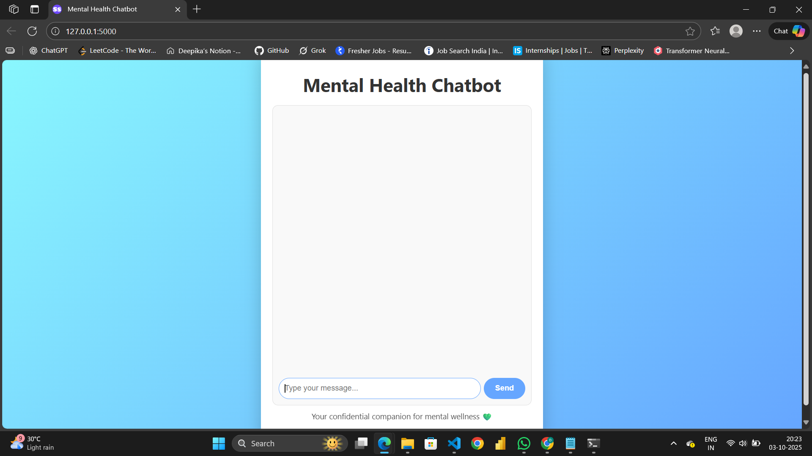

# Mental Health Chatbot using GenAI

A **compassionate AI-powered mental health chatbot** built using **LangChain**, **Groq LLM**, and **ChromaDB**.  
This chatbot can answer mental health queries by retrieving information from PDF documents and providing thoughtful responses in a conversational interface built with **Flask**.

---

## 🔧Features

- AI-powered mental health chatbot.
- Uses **LangChain + Groq LLM** for natural language responses.
- Contextual responses via **Chroma Vector Database** from PDFs.
- Interactive **web interface with Flask**.
- Stylish, professional chat interface with colored chat bubbles.
- Safe API key management using `.env` file.

---

## 🎨 Demo



---

## 🚀 Installation & Setup

1. **Clone the repository**

   ```bash
   git clone https://github.com/Deepika-saravanan/Mental-Health-Chatbot-using-GENAI.git
   cd Mental-Health-Chatbot-using-GENAI
   ```
   
2. **Create a virtual environment**

   ```bash
   python -m venv venv
   source venv/bin/activate  # (macOS/Linux)
   venv\Scripts\activate     # (Windows PowerShell)
   ```

3. **Install dependencies**

   ```bash
   pip install -r requirements.txt
   ```

4. **Create a .env file in the root folder and add your Groq API key**

   ```bash
   GROQ_API_KEY=your_api_key_here
   ```
5. **Run the web app (Flask)**

   ```bash
   python app.py
   ```

   Access at `http://127.0.0.1:8000` 

---

## 📝 Usage

1. Place your PDF files in the `data/` folder.
2. Start chatting via the web interface.

---

## ⚙️ How It Works

```text
The chatbot combines Large Language Models, vector search, and a Flask web interface:

1. Frontend: Users type messages in the web interface; messages are sent to the backend.
2. Backend: Flask receives input and calls get_response() from chatbot.py.
3. Language Model: Groq LLM generates thoughtful responses using context from PDFs.
4. Vector Database: ChromaDB stores embeddings of PDFs to retrieve relevant information.
5. RAG: Retriever fetches relevant text from ChromaDB, passed to LLM to produce context-aware answers.
6. Response: Backend sends the answer to the frontend; chat is displayed in styled bubbles.

```

---

## 🔒 Security Notes
- Do not push your `.env` file or API keys to GitHub.
- The `.gitignore` file ignores `.env` and the `chroma_db/` folder.
